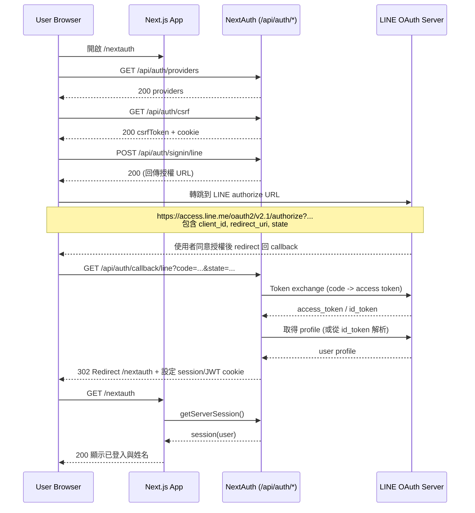

# LINE Login URL 跳轉流程（NextAuth）

這份文件說明「使用 LINE 登入」時，瀏覽器與後端之間的 URL 跳轉與 API 呼叫順序。

## 1. 角色

- Browser：使用者瀏覽器
- App：你的 Next.js App（`http://localhost:3000`）
- NextAuth：`/api/auth/*` 路由處理器
- LINE：`https://access.line.me` / `https://api.line.me`

## 2. 時序圖

## 3. URL 跳轉與目的

1. `GET /nextauth`  
   顯示登入頁，前端按鈕準備呼叫 `signIn('line')`。

2. `GET /api/auth/providers`  
   讀取可用 provider 清單（包含 `line`）。

3. `GET /api/auth/csrf`  
   取得 CSRF token，給後續 signin 請求使用。

4. `POST /api/auth/signin/line`  
   NextAuth 產生 LINE 授權 URL（含 `state`），並觸發前端轉跳。

5. `https://access.line.me/oauth2/v2.1/authorize?...`  
   使用者在 LINE 登入並同意授權。

6. `GET /api/auth/callback/line?code=...&state=...`  
   LINE 回呼你站上的 callback。  
   NextAuth 在這一步驗證 `state`、用 `code` 換 token、拿 profile。

7. `302 -> /nextauth`  
   NextAuth 建立 session/JWT cookie 後導回頁面。

8. `GET /nextauth`  
   Server Component 透過 `getServerSession(getAuthOptions())` 讀 session，顯示登入狀態與姓名。

## 4. 授權 URL 重要參數

- `client_id`：LINE channel id
- `redirect_uri`：必須和 LINE Developers Callback URL 完全一致  
  目前：`http://localhost:3000/api/auth/callback/line`
- `response_type=code`：使用 authorization code flow
- `scope=openid profile`：要求基本身份資料
- `state`：防 CSRF

## 5. 你目前 log 的成功判斷點

當看到以下訊息，代表登入成功：

- `OAUTH_CALLBACK_RESPONSE` 有 `profile.id` / `profile.name`
- `[nextauth][jwt] token issued`
- `[nextauth][event] signIn`
- `GET /api/auth/callback/line ... 302`
- `GET /nextauth 200`

